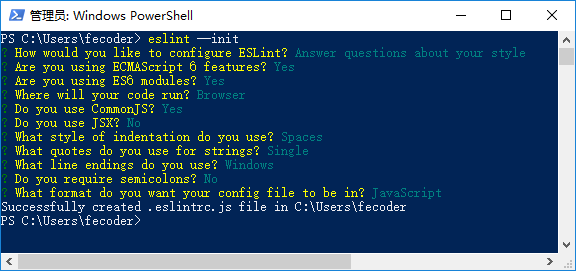

# vscode 配置ESLint拓展

## 配置流程

1. 全局或者某工程根目录下安装eslint npm install eslint -g
> 如果你仅仅想让 ESLint 成为你项目构建系统的一部分，我们可以在项目根目录进行本地安装：
 ``` 
  npm install eslint --save-dev
 ```

> 如果想使 ESLint 适用于你所有的项目，我们建议使用全局安装，使用全局安装 ESLint 后，你使用的任何 ESLint 插件或可分享的配置也都必须在全局安装。 
 ``` 
  npm install -g eslint
```

2. vscode中安装eslint插件

3. 工程根目录下使用eslint --init来生成一个eslint配置文件，安装提示来。
> 安装完毕后，我们使用 eslint --init 命令在用户目录中生成一个配置文件（也可以在任何你喜欢的位置进行生成）



## 配置规则


## vscode设置ESLint拓展
> 安装并配置完成 ESLint 后，我们继续回到 VSCode 进行扩展设置，依次点击 文件 > 首选项 > 设置 打开 VSCode 配置文件
```
"eslint.options": {
    "configFile": "E:/git/github/styleguide/eslint/.eslintrc.js"
},
```


## vscode 用户设置
```
{
  "editor.fontSize": 18,
  "javascript.implicitProjectConfig.experimentalDecorators": true,
  "workbench.colorTheme": "Brackets Light Pro",
  "files.eol": "\r\n",  
  "eslint.enable": true,  
  "eslint.options": {
    "configFile": "C:/workspace/.eslintrc.js"
  },  
  "fileheader.Author": "lll",
  "fileheader.LastModifiedBy": "lll",
  "workbench.iconTheme": "verdandi",
  "editor.minimap.enabled": true,
  "eslint.autoFixOnSave": true,
  "eslint.validate": [
    "javascript",
    "javascriptreact",
    "html",
  ],
  "files.autoSave": "onFocusChange",
  "editor.tabSize": 2,
  "editor.detectIndentation": false,
  "files.exclude": {
    "**/.git": true,
    "**/.svn": true,
    "**/.hg": true,
    "**/CVS": true,
    "**/.DS_Store": true,
    "**/node_modules":true
  },  
}
```

